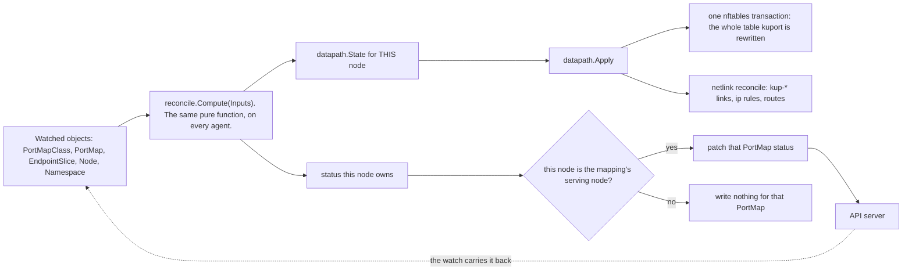
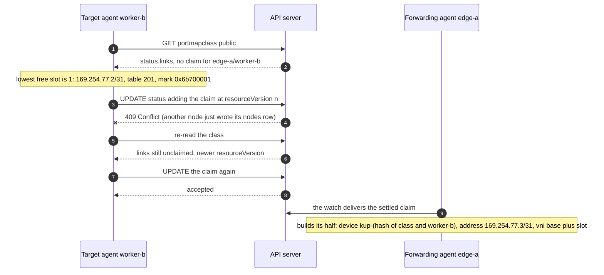

# Architecture

One DaemonSet. Each pod watches the API and programs the node it is on. There is
no central controller and no leader election.

```
PortMapClass ─┐
PortMap ──────┼─→ agent on each node ─→ desired ruleset for THIS node ─→ nftables
EndpointSlice ┘                      └─→ desired links and routes ────→ netlink
```

Every agent computes from the same inputs with the same deterministic
tie-breaks, so they agree without talking to each other. An endpoint moving
changes the input on every agent at once, through the same watch.



Every agent runs the computation; the picture is one node's pass. Two agents
reaching different conclusions would program different pods, which is why every
tie-break in Compute is deterministic rather than negotiated.

## The reconcile

The reconcile is level-driven. Each pass builds the complete desired state for
this node and applies it in one nftables transaction, so a mapping that was
deleted disappears by being absent rather than by anything remembering to
remove it.

Every agent resolves every PortMap from the same shared inputs, then emits only
the objects this node owns.

Resolution:

1. Resolve serviceRef to the ready IPv4 endpoints of the named port.
2. Choose one. Candidates on an accepting node rank above all others, ordered by
   accepting-node name and then by pod name within a node; with no candidate on
   an accepting node, the ready candidate with the smallest pod name wins. No
   input describes where the agent runs, so every agent picks the same endpoint.
3. Fix the serving node: the chosen endpoint's node when that node accepts the
   class, otherwise the first accepting node by name.

Under `Single` exactly one node serves each mapping. Under `Multi` every
accepting node programs it and the serving node keeps its separate job of
writing status. [Serving modes](datapath.md#serving-modes) has the difference.

Emission on a node that accepts the mapping:

1. A DNAT rule per interface in the class. A pod on this node is translated
   straight to; a pod elsewhere is translated to the far end of this node's own
   return link.
2. The masquerade exemption for the inbound leg, following the device the packet
   leaves by.
3. When the chosen pod is on another node, this end of the return link, once its
   address slot has landed in the class status.

Emission on the node holding the chosen pod, when another node forwards to it:

1. This end of each return link.
2. A DNAT rule per link, completing the translation to the pod.
3. The return marking, the routing rules and the table entries.
4. The masquerade exemption for the reply.

Every other node emits nothing for the mapping.

## Status writing

The mapping's serving node writes its PortMap status; every other agent writes
none for that mapping. That gives exactly one writer per PortMap without leader
election, and it changes hands when the endpoint or the accepting set moves. A
refused or endpoint-less mapping has no serving node, so its status falls to the
chosen endpoint's node, else the first accepting node by name, else the first
node in the cluster: one writer in every case.

The class status has its own single-writer rule per field: each node writes its
own `nodes` row, and only the agent holding a mapping's endpoint proposes a
`links` claim. Two agents claiming the same pair collide on the API server's
optimistic concurrency, and the loser re-reads and adopts the winner's slot.

For a remote pod the forwarding node waits on the pod's node, because the claim
for their link pair is proposed there. Until it lands in the class status the
mapping reports `Programmed=False` with reason `ReturnPathUnavailable` and a
message naming the missing pair. The class status write is itself watched, so
the next pass sees the settled claim and the condition clears.



The claim settles the whole derivation: the /31 ends are fixed by the sorted
node names, so both halves compute each other's address without exchanging
anything beyond the recorded slot.
