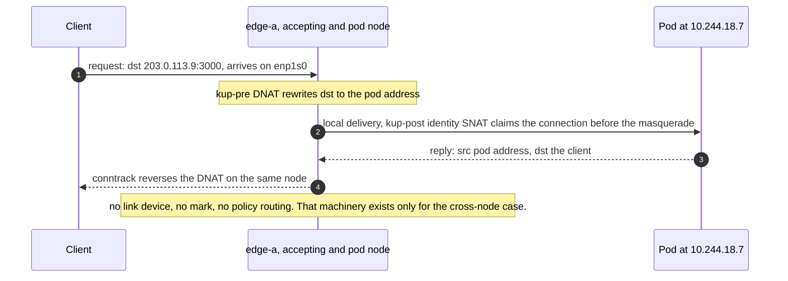
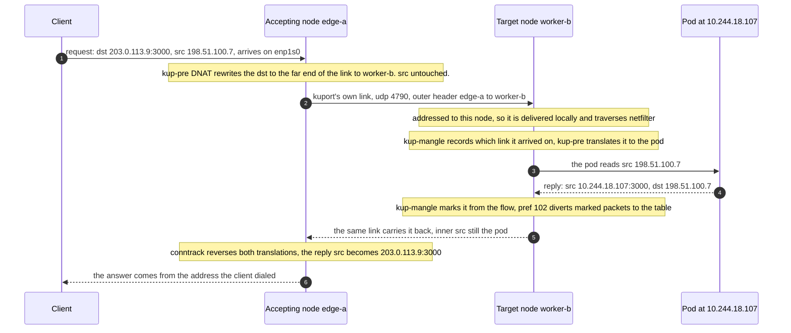
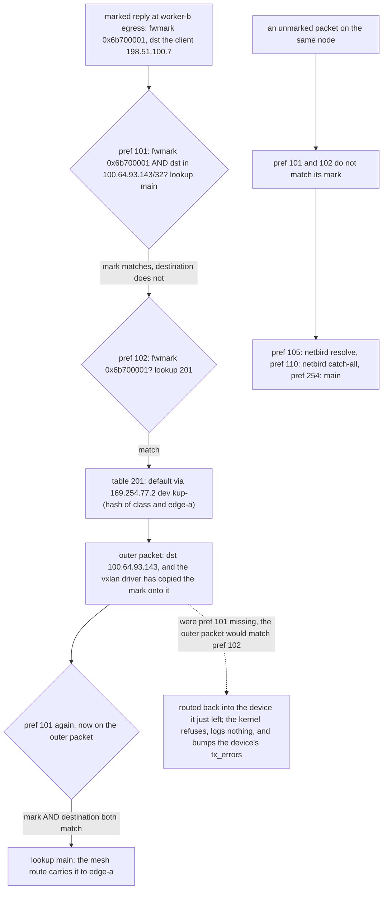
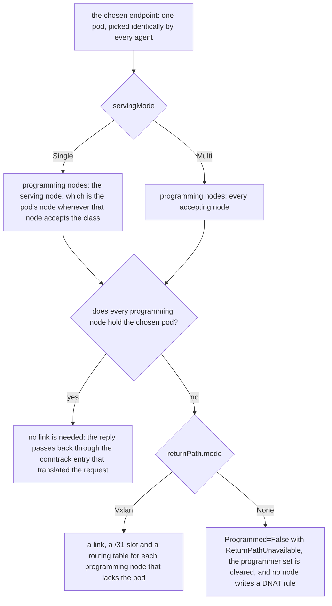

# Datapath

Every rule here carried real traffic on a live cluster before it was written
down, and each one names the measurement that confirmed it. Several of them
contradict what the documentation suggests, which is why the measurements stay.

Two shapes cover everything: the pod sits on the node that accepted the packet,
or it does not.

## Same node



## Cross node



Both legs ride kuport's own link since v0.4.0. Before that the request travelled
the CNI's tunnel while only the reply used the link, which tied the design to
Cilium's routing mode and made `Multi` impossible.
[The decision](decisions.md#carrying-both-legs-on-kuports-own-link) records why
it changed and what measurement forced it.

Routing by default from worker-b would send the reply out worker-b's own
internet connection with the pod address as source, and the client's firewall
discards it as spoofed. The link is what stops that.

## Why the destination is translated twice

WireGuard accepts a decrypted packet only when its source falls inside the
allowed IPs of the peer that sent it, and a mesh gives each peer a single /32. A
forwarded packet keeping the client's source is discarded inside WireGuard,
before netfilter, so no nftables rule on either node can rescue it.

Measured: with a NodePort target, the accepting node translated and forwarded,
and every counter on the target node stayed at zero. The packet was gone before
prerouting.

An encapsulation is what fixes it. The outer header carries the two nodes' own
addresses, WireGuard accepts it, and the inner packet reaches the far side with
the client's source intact. Measured: 54ms round trip, cross-node, client address
preserved.

The accepting node therefore translates to something reachable over the link
rather than to the pod, and the far side finishes the job. Two translations, each
reversed by its own node's conntrack, and neither touches the source.

Going to an address rather than a NodePort also removes two problems. There is
no second port number from the 30000-32767 range for people to know about, and
there is no second DNAT. That matters, because a packet is destination-NATed once
per netfilter hook: an accepting node that DNATs to its own NodePort makes
kube-proxy's rules a no-op. Measured: the DNAT counter climbed, conntrack showed
the node address as the reply source rather than the pod's, and the pod never saw
the packet.

## Rules on an accepting node

```
table ip kuport {
  chain kup-pre {
    type nat hook prerouting priority dstnat - 10; policy accept;
    iifname "<iface>" <proto> dport <port> counter dnat to <target>:<port>
    ...one per interface per mapping...
  }

  chain kup-post {
    type nat hook postrouting priority srcnat - 10; policy accept;
    oifname "<egress dev>" ip daddr <target> <proto> dport <port> counter snat to ip saddr
  }
}
```

`<target>` is the pod's address when the pod is on this node, and the far end of
this node's link to the pod's node when it is not. `<egress dev>` follows it:
`cilium_host` for a local pod, the link device for a remote one.

A mapping with a port range renders one rule with a range match instead:
`udp dport 27015-27115 counter dnat to 10.244.18.107:27015-27115`. The golden
rulesets in `internal/datapath/testdata/` are the rendered truth.

The postrouting rule is an identity SNAT, and its job is to claim the connection
before the CNI does. Cilium rewrites the source of anything entering the pod
network through cilium_host whose source is outside the node's pod CIDR, which is
exactly a forwarded packet:

```
oifname "cilium_host" ip saddr != <node pod cidr> ip daddr != <node pod cidr> SNAT
```

Netfilter sets up source NAT once per hook, so the rule that claims the
connection first wins. Measured: with the exemption absent the pod reported the
node's cilium_host address as the client; with it present the pod reported the
real client.

The exemption carries the same `oifname` as the rule it precedes, so it claims
only what that rule would have claimed. Traffic reaching the same pod on the same
port from inside the cluster leaves by another interface and is untouched.

This depends on netfilter's once-per-hook behaviour and on kuport's chain sorting
first, rather than on the text of any CNI rule, so an upgrade that rewords the
masquerade rules does not break it.

## Rules on the pod's node

```
table ip kuport {
  chain kup-pre {
    type nat hook prerouting priority dstnat - 10; policy accept;
    iifname "kup-<peer>" ip daddr <this end of that /31> <proto> dport <port> counter dnat to <pod ip>:<port>
    ...one per link...
  }

  chain kup-post {
    type nat hook postrouting priority srcnat - 10; policy accept;
    oifname != "cilium_*" ip saddr <pod ip> <proto> sport <port> counter snat to ip saddr
  }

  chain kup-mangle {
    type filter hook prerouting priority mangle + 10; policy accept;
    ...the return marking, which differs by serving mode...
  }
}
```

```
ip rule  add pref 101 fwmark <mark> to <peer node address>/32 lookup main
ip rule  add pref 102 fwmark <mark> lookup <table>
ip route add default via <peer's link address> dev <link> table <table>
```

The prerouting rule matches the arrival device and this node's own end of that
link, which keeps it to kuport's own traffic rather than anything else that
reaches the device.

The postrouting rule exempts the reply from the CNI's egress masquerade, which
would otherwise rewrite its source to the node's own address and send it out that
node's own internet connection. Measured: without it, the reply left the target
site entirely and the client's conntrack discarded it.

The mark is what keeps the diversion narrow. Measured: a rule selecting on the
pod's address instead broke that pod's internet egress completely, while leaving
its in-cluster traffic alone, because Cilium's own routing rule at pref 9 catches
that first.

## Two rule-ordering constraints

**The rule must sit above the mesh's.** netbird owns pref 110 and sends
everything without its mark to its own table, and pref 105 resolves the
destination out of the main table before that. A return rule at 32001 never
fires; the reply has already left. The rules go above 105 and below the local
table at 100.

**The first rule prevents a routing loop.** The VXLAN driver copies the packet's
mark onto the encapsulated packet, whose destination is the peer's address. That
outer packet then matches the second rule and is routed back into the device it
just came out of. The kernel refuses and increments the device's `tx_errors` with
no log line anywhere. Measured: one transmit error per probe, and the reply never
left.



## The link

```
ip link add <name> type vxlan id <vni> local <own address> remote <peer address> \
  dstport <port> ttl 64 mtu <link mtu>
ip addr add <link address>/31 dev <name>
ip link set <name> up
```

The device name is `kup-` plus the first eight hex digits of sha256 of the class
name and the peer's node name, so both ends independently name the same device
and two classes over one node pair do not collide. The two addresses of the /31
are fixed by the sorted pair: the alphabetically first node takes the lower
address.

The VNI is the class's base plus the slot, because the kernel keys a vxlan device
by VNI and destination port, so two links on one node cannot share both.

The outer header carries the two nodes' addresses, which the mesh accepts, so no
key material is involved and nothing needs renewing. Measured: 12ms across two
sites on the first try.

The port must differ from the CNI's, 8472 for Cilium.

GRE would be lighter, 24 bytes against 50. Talos does not ship the module:
`ip link add type gre` answers `Unknown device type`. A second WireGuard link
would work and brings keys, which then need generating, storing and renewing.

## Serving modes

`servingMode` decides how many nodes carry the mapping's rules.

| | `Single`, the default | `Multi` |
| --- | --- | --- |
| Nodes with DNAT rules | the serving node alone | every accepting node |
| Address a client dials | the serving node's, which moves when the pod moves | any accepting node's, so a routed virtual address works |
| Links on the pod's node | at most one | one per accepting node that lacks the pod |
| Return marking | a static mark rule | the flow's conntrack entry |
| Status writer | the serving node | the serving node, unchanged |

Under `Single` every other accepting node stays outside the mapping: no rules, no
status, no refusal.

### A Single class

One accepting node with a public address, pods placed freely:

```yaml
apiVersion: kuport.wlz.li/v1alpha1
kind: PortMapClass
metadata:
  name: public
spec:
  nodes:
    edge-a:
      interfaces: [enp1s0, wt0]
  ports:
    min: 1024
    max: 65535
    reserved: [80, 443]
  returnPath:
    mode: Vxlan
```

Clients dial `edge-a`'s addresses. A pod anywhere in the cluster is reached over
a link from edge-a, and the mapping follows the pod when it reschedules.

### A Multi class

Every worker accepts, so a routed address is served wherever the mesh lands a
client:

```yaml
apiVersion: kuport.wlz.li/v1alpha1
kind: PortMapClass
metadata:
  name: intranet
spec:
  servingMode: Multi
  nodes:
    worker-1:
      interfaces: [wt0]
    worker-2:
      interfaces: [wt0]
    worker-3:
      interfaces: [wt0]
  returnPath:
    mode: Vxlan
    vxlan:
      vni: 4300
      subnet: 169.254.79.0/24
```

Clients dial one address that every worker holds. Whichever worker receives the
packet forwards it to the single chosen pod, and the pod's node sends each reply
back to the worker that forwarded it.

The class carries its own `vni` and `subnet` because its accepting nodes overlap
with `public` above, and two classes numbering slots from zero would collide on
the first VNI and the first /31.

### Why Multi needs conntrack

A routed virtual address may land on any of the class's nodes, and a client
reaching a node with no rules gets nothing. Two accepting nodes forwarding to one
remote pod need that pod's node to send each reply back to whichever node
forwarded it, and the reply carries nothing that says which: the client address
does not determine the path, because which node a client reaches is the mesh's
routing choice and free to change.

The request arriving on that node's own link is what answers it. The device names
the forwarder, and the pod's node records it in the only place that spans a
request and its reply:

```
request in on kup-<peer>   ->  ct mark set <peer mark>     (meta mark untouched,
                                                            so the request is not
                                                            diverted on its way in)
reply from the pod         ->  meta mark set ct mark       (then pref 101/102 as
                                                            under Single)
```

The rules match disjointly and neither issues a verdict, so their order does not
matter: a request arriving on a link carries the client's source address and
never matches the restore rule, and a reply from the pod arrives on its veth and
never matches a save rule.

A flow with no conntrack entry restores mark 0, matches no divert rule, and
leaves by the node's own uplink. The next inbound packet writes the mark again,
because the save rule matches the arrival interface rather than any stored state,
so a flow heals itself as soon as the client speaks.

### What Multi depends on

The mark lives as long as the conntrack entry, which is a limitation to size
rather than a corner case:

| Protocol | Sysctl | Linux default |
| --- | --- | --- |
| TCP, established | `nf_conntrack_tcp_timeout_established` | 432000s, 5 days |
| UDP, one direction seen | `nf_conntrack_udp_timeout` | 30s |
| UDP, both directions seen | `nf_conntrack_udp_timeout_stream` | 120s |

A flow idle past its timeout recovers on the next packet from the client. A
packet the pod sends first in that window is lost, and for a workload that pushes
to an idle client the loss continues until the client speaks. Request and
response traffic is unaffected, since the client always goes first.

`Single` carries the same shape of dependency already: the accepting node's DNAT
is conntrack-based, so a reply after the entry ages out is not translated back
and the client discards it. `Multi` extends that dependency to the pod's node
rather than introducing a new kind of failure.

## returnPath mode

`Vxlan` builds the link described above. `None` builds no link and refuses any
mapping that would need one.

A mapping needs a link when the pod sits on a node other than one holding a DNAT
rule. The conntrack entry that records the address the client originally dialed
lives on the accepting node alone. A reply leaving the pod's node by its own
uplink carries the pod address as source, and the client discards it as spoofed.

`None` refuses the mapping before any of that is programmed, so the port stays
closed and the PortMap status says why.



| servingMode | Where the chosen pod sits | `Vxlan` | `None` |
| --- | --- | --- | --- |
| `Single` | on the serving node | programmed, no link built | programmed, no link built |
| `Single` | on a node outside the class's accepting nodes | programmed, one link | refused |
| `Multi`, one accepting node | on that node | programmed, no link built | programmed, no link built |
| `Multi`, several accepting nodes | anywhere | programmed, one link per accepting node that lacks the pod | refused |

Under `Multi` the comparison runs over every accepting node against the one
chosen endpoint, so a class with several accepting nodes refuses every mapping
while `None` is set. There is no per-node endpoint choice to fall back on:
chooseEndpoint returns a single pod for the whole mapping, which is what stops
two agents from programming different pods.

`None` is the setting for a class whose pods already sit on its accepting nodes,
which under `Single` means a DaemonSet, or a workload pinned to an accepting node
by its own scheduling constraints. Only one of a DaemonSet's pods receives
traffic for a given mapping; the rest are there so the endpoint choice always
finds a candidate on an accepting node. A rescheduling that moves the pod off the
accepting set then surfaces as a refused mapping carrying
ReturnPathUnavailable. Under `Vxlan` the same rescheduling builds a link and the
mapping keeps working, which is the answer a class wants when pod placement is
free.

## MTU

Each link is created and kept at the smaller of its two ends' underlays less the
encapsulation, which both agents read from the same two class status rows, so the
ends agree without negotiating. A peer that has written no row yet leaves the
link at this node's own figure, and the pass after that peer's first status write
shrinks it.

Releases up to v0.3.4 left every device at the kernel's 1500, which put the split
on the encapsulated packet after the fact and advertised a size the path could
not carry.

A datagram over the figure still crosses. The forwarding path splits it and the
far side reassembles, measured on 2026-09-08 at reply sizes up to 1576 bytes, and
a sender that set DF receives an ICMP carrying the correct MTU rather than
silence. [Reading the numbers](troubleshooting.md#mtu) covers what an operator
does with them.
