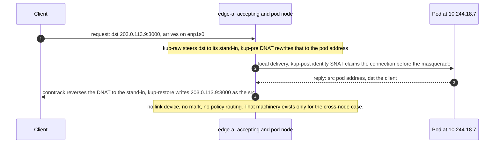
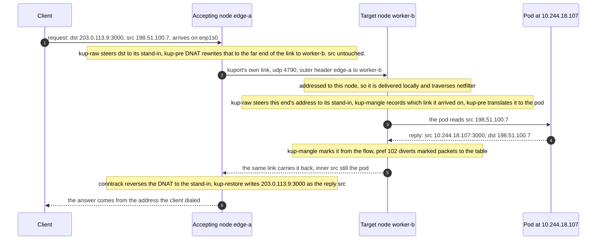
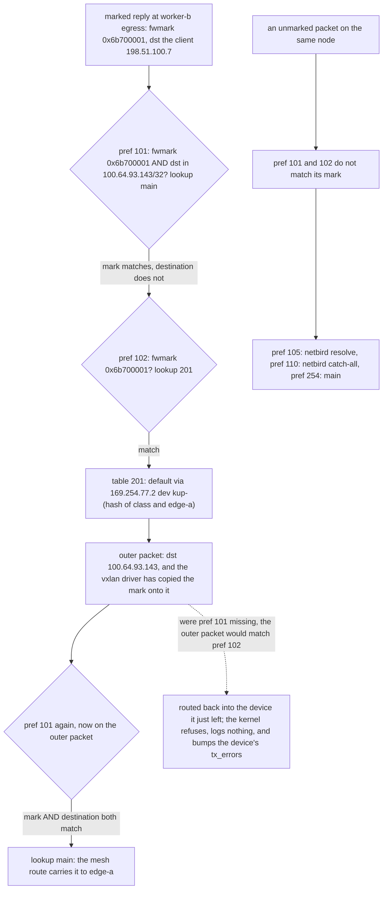
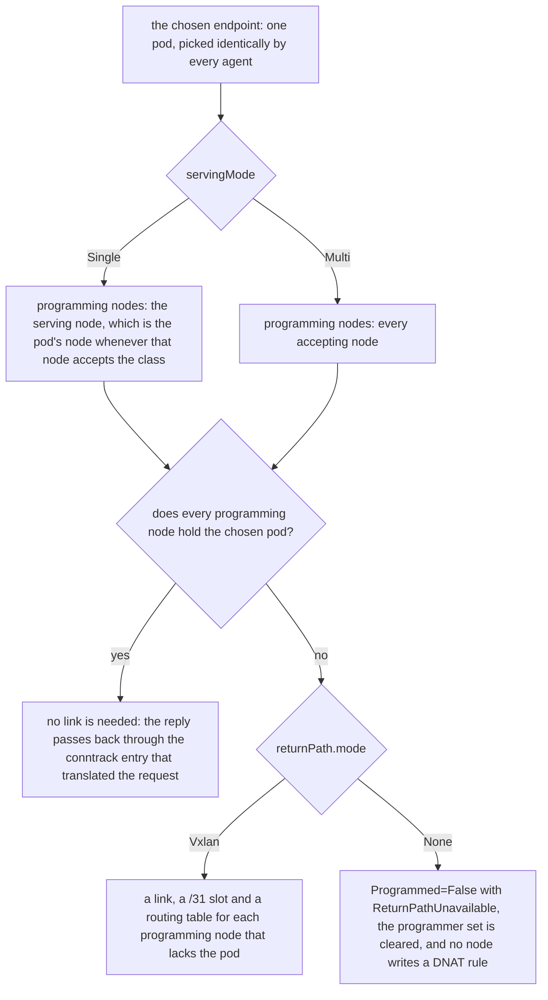

# Datapath

Every IPv4 rule here carried real traffic on a live cluster before it was
written down, and each one names the measurement that confirmed it. Several of
them contradict what the documentation suggests, which is why the measurements
stay. The IPv6 rules in [IPv6](#ipv6) have been loaded into a kernel by the
datapath tests and have not yet carried traffic on a cluster. The steering
rules in [Host firewall](#host-firewall) carried TCP and UDP in both families
through a copy of Talos's firewall chain in the datapath tests' network
namespaces, and have not yet carried traffic on a cluster.

Two shapes cover everything: the pod sits on the node that accepted the packet,
or it does not.

## Same node


```mermaid
sequenceDiagram
    autonumber
    participant C as Client
    participant N as edge-a, accepting and pod node
    participant P as Pod at 10.244.18.7
    C->>N: request: dst 203.0.113.9:3000, arrives on enp1s0
    Note over N: kup-raw steers dst to its stand-in, kup-pre DNAT rewrites that to the pod address
    N->>P: local delivery, kup-post identity SNAT claims the connection before the masquerade
    P-->>N: reply: src pod address, dst the client
    N-->>C: conntrack reverses the DNAT to the stand-in, kup-restore writes 203.0.113.9:3000 as the src
    Note over N: no link device, no mark, no policy routing. That machinery exists only for the cross-node case.
```

## Cross node


```mermaid
sequenceDiagram
    autonumber
    participant C as Client
    participant E as Accepting node edge-a
    participant T as Target node worker-b
    participant P as Pod at 10.244.18.107
    C->>E: request: dst 203.0.113.9:3000, src 198.51.100.7, arrives on enp1s0
    Note over E: kup-raw steers dst to its stand-in, kup-pre DNAT rewrites that to the far end of the link to worker-b. src untouched.
    E->>T: kuport's own link, udp 4790, outer header edge-a to worker-b
    Note over T: addressed to this node, so it is delivered locally and traverses netfilter
    Note over T: kup-raw steers this end's address to its stand-in, kup-mangle records which link it arrived on, kup-pre translates it to the pod
    T->>P: the pod reads src 198.51.100.7
    P-->>T: reply: src 10.244.18.107:3000, dst 198.51.100.7
    Note over T: kup-mangle marks it from the flow, pref 102 diverts marked packets to the table
    T-->>E: the same link carries it back, inner src still the pod
    Note over E: conntrack reverses the DNAT to the stand-in, kup-restore writes 203.0.113.9:3000 as the reply src
    E-->>C: the answer comes from the address the client dialed
```

Both legs ride kuport's own link since v0.4.0. Before that the request travelled
the CNI's tunnel while only the reply used the link, which tied the design to
Cilium's routing mode and made `Multi` impossible.
[The decision](decisions.md#carrying-both-legs-on-kuports-own-link) records why
it changed and what measurement forced it.

Routing by default from worker-b would send the reply out worker-b's own
internet connection with the pod address as source, and the client's firewall
discards it as spoofed. The link is what stops that.

## Why the destination is translated twice

WireGuard accepts a decrypted packet only when its source falls inside the
allowed IPs of the peer that sent it, and a mesh gives each peer a single /32. A
forwarded packet keeping the client's source is discarded inside WireGuard,
before netfilter, so no nftables rule on either node can rescue it.

Measured: with a NodePort target, the accepting node translated and forwarded,
and every counter on the target node stayed at zero. The packet was gone before
prerouting.

An encapsulation is what fixes it. The outer header carries the two nodes' own
addresses, WireGuard accepts it, and the inner packet reaches the far side with
the client's source intact. Measured: 54ms round trip, cross-node, client address
preserved.

The accepting node therefore translates to something reachable over the link
rather than to the pod, and the far side finishes the job. Two translations, each
reversed by its own node's conntrack, and neither touches the source.

Going to an address rather than a NodePort also removes two problems. There is
no second port number from the 30000-32767 range for people to know about, and
there is no second DNAT. That matters, because a packet is destination-NATed once
per netfilter hook: an accepting node that DNATs to its own NodePort makes
kube-proxy's rules a no-op. Measured: the DNAT counter climbed, conntrack showed
the node address as the reply source rather than the pod's, and the pod never saw
the packet.

## Rules on an accepting node

```
table inet kuport {
  map kup-steer4 {
    type ipv4_addr : ipv4_addr
    elements = { <node address> : <stand-in>, ...one per address the node holds... }
  }
  map kup-restore4 {
    ...the same pairs the other way round...
  }
  ...kup-steer6 and kup-restore6 for IPv6...

  chain kup-raw {
    type filter hook prerouting priority raw - 10; policy accept;
    meta nfproto ipv4 iifname "<iface>" <proto> dport <port> ip daddr set ip daddr map @kup-steer4 counter
    meta nfproto ipv6 iifname "<iface>" <proto> dport <port> ip6 daddr set ip6 daddr map @kup-steer6 counter
    ...one per interface per family per mapping...
  }

  chain kup-pre {
    type nat hook prerouting priority dstnat - 20; policy accept;
    meta nfproto ipv4 iifname "<iface>" <proto> dport <port> counter dnat ip to <target>:<target port>
    meta nfproto ipv6 iifname "<iface>" <proto> dport <port> counter dnat ip6 to [<target6>]:<target port>
    ...one per interface per family per mapping...
  }

  chain kup-post {
    type nat hook postrouting priority srcnat - 10; policy accept;
    oifname "<egress dev>" ip daddr <target> <proto> dport <target port> counter snat ip to ip saddr
    oifname "<egress dev>" ip6 daddr <target6> <proto> dport <target port> counter snat ip6 to ip6 saddr
  }

  chain kup-restore {
    type filter hook postrouting priority srcnat + 10; policy accept;
    meta nfproto ipv4 ip saddr set ip saddr map @kup-restore4 counter
    meta nfproto ipv6 ip6 saddr set ip6 saddr map @kup-restore6 counter
  }
}
```

The `ip6` lines exist only for a mapping delivered over IPv6, which
[IPv6](#ipv6) covers. kup-raw, kup-restore and the maps carry a mapping past a
host firewall; [Host firewall](#host-firewall) walks a packet through them.

`<target>` is the pod's address when the pod is on this node, and the far end of
this node's link to the pod's node when it is not. `<egress dev>` follows it:
`cilium_host` for a local pod, the link device for a remote one.

`<target port>` is the pod's port for a local pod: the number the EndpointSlice
lists under `serviceRef.port`, which is `<port>` unless the mapping translates.
Toward a link it stays `<port>`, and the pod's node writes the pod's port. The
postrouting rule sees the packet after the DNAT, so it matches `<target port>`;
matching `<port>` there would miss a translated packet and leave it to the CNI's
masquerade, which replaces the client's address.

A mapping with a port range renders one rule with a range match instead:
`udp dport 27015-27115 counter dnat ip to 10.244.18.107:27015-27115`. The golden
rulesets in `internal/datapath/testdata/` are the rendered truth.

The postrouting rule is an identity SNAT, and its job is to claim the connection
before the CNI does. Cilium rewrites the source of anything entering the pod
network through cilium_host whose source is outside the node's pod CIDR, which is
exactly a forwarded packet:

```
oifname "cilium_host" ip saddr != <node pod cidr> ip daddr != <node pod cidr> SNAT
```

Netfilter sets up source NAT once per hook, so the rule that claims the
connection first wins. Measured: with the exemption absent the pod reported the
node's cilium_host address as the client; with it present the pod reported the
real client.

The exemption carries the same `oifname` as the rule it precedes, so it claims
only what that rule would have claimed. Traffic reaching the same pod on the same
port from inside the cluster leaves by another interface and is untouched.

This depends on netfilter's once-per-hook behaviour and on kuport's chain sorting
first, rather than on the text of any CNI rule, so an upgrade that rewords the
masquerade rules does not break it.

## Rules on the pod's node

```
table inet kuport {
  ...the steer and restore maps, as on the accepting node...

  chain kup-raw {
    type filter hook prerouting priority raw - 10; policy accept;
    meta nfproto ipv4 iifname "kup-<peer>" <proto> dport <port> ip daddr set ip daddr map @kup-steer4 counter
    meta nfproto ipv6 iifname "kup-<peer>" <proto> dport <port> ip6 daddr set ip6 daddr map @kup-steer6 counter
    ...one per link per family...
  }

  chain kup-pre {
    type nat hook prerouting priority dstnat - 20; policy accept;
    iifname "kup-<peer>" ip daddr <stand-in of this end of that /31> <proto> dport <port> counter dnat ip to <pod ip>:<pod port>
    iifname "kup-<peer>" ip6 daddr <stand-in of this end of that /127> <proto> dport <port> counter dnat ip6 to [<pod ip6>]:<pod port>
    ...one per link per family...
  }

  chain kup-post {
    type nat hook postrouting priority srcnat - 10; policy accept;
    oifname != "cilium_*" ip saddr <pod ip> <proto> sport <pod port> counter snat ip to ip saddr
    oifname != "cilium_*" ip6 saddr <pod ip6> <proto> sport <pod port> counter snat ip6 to ip6 saddr
  }

  chain kup-mangle {
    type filter hook prerouting priority mangle + 10; policy accept;
    ...the return marking, which differs by serving mode...
  }

  ...kup-restore, as on the accepting node...
}
```

```
ip rule     add pref 101 fwmark <mark> to <peer node address>/32 lookup main
ip rule     add pref 102 fwmark <mark> lookup <table>
ip route    add default via <peer's link address> dev <link> table <table>
ip -6 rule  add pref 102 fwmark <mark> lookup <table>
ip -6 route add default via <peer's IPv6 link address> dev <link> table <table>
```

The `ip6` rules and the two `-6` commands exist only for a mapping delivered
over IPv6. They reuse the mark and the table of the IPv4 ones; the kernel
keeps a table's IPv4 and IPv6 routes apart, so table 200 holds one default
route in each family.

The prerouting rule matches the arrival device and this node's own end of that
link, which keeps it to kuport's own traffic rather than anything else that
reaches the device. The end is a local address, so kup-raw has replaced it with
its stand-in by the time kup-pre runs, and the rule matches the stand-in.

The postrouting rule exempts the reply from the CNI's egress masquerade, which
would otherwise rewrite its source to the node's own address and send it out that
node's own internet connection. Measured: without it, the reply left the target
site entirely and the client's conntrack discarded it.

The mark is what keeps the diversion narrow. Measured: a rule selecting on the
pod's address instead broke that pod's internet egress completely, while leaving
its in-cluster traffic alone, because Cilium's own routing rule at pref 9 catches
that first.

## Host firewall

A host firewall in block mode drops a new connection to one of the node's own
addresses unless a rule opens its port. Talos's ingress firewall does it from a
filter chain in prerouting at `dstnat - 10`, priority -110. `nft monitor trace`
of a datagram to a mapped port, on a Talos node running v0.6.2, ends like this
(the packet lines are left out):

```
trace id dfa9b8e8 ip raw PREROUTING rule xt match "comment" counter packets 2920253 bytes 4124198906 jump CILIUM_PRE_raw (verdict jump CILIUM_PRE_raw)
trace id dfa9b8e8 ip netbird netbird-raw-pre policy accept
trace id dfa9b8e8 ip mangle PREROUTING policy accept
trace id dfa9b8e8 ip netbird netbird-mangle-prerouting policy accept
trace id dfa9b8e8 inet kuport kup-mangle policy accept
trace id dfa9b8e8 inet talos prerouting rule ct state new meta l4proto udp counter packets 2332 bytes 304917 drop (verdict drop)
```

kup-pre was declared at `dstnat - 20` and never appears. The kernel registers
one NAT hook per family and hook point, at `NF_IP_PRI_NAT_DST` (-100) in
prerouting, and calls every `type nat` chain from it: `nf_nat_register_fn` in
net/netfilter/nf_nat_core.c inserts the chain into that hook's list. A nat
chain's priority orders it among the other nat chains only, so no nat chain
runs before a filter chain at -110.

kuport therefore moves the destination out of the firewall's way before
conntrack sees the packet, and puts it back on the reply. Take node-a from
[the worked example](#rendered-rules-for-a-dual-stack-mapping), which holds
203.0.113.9 on eth0, and a TCP request to 203.0.113.9:3000:

| Hook, priority | Step | Request destination after it |
| --- | --- | --- |
| prerouting, -310 | kup-raw: `ip daddr set ip daddr map @kup-steer4` | 169.254.76.3:3000 |
| prerouting, -200 | conntrack records the flow | 169.254.76.3:3000 |
| prerouting, -110 | host firewall: 169.254.76.3 is no node address, so its rule accepts it | 169.254.76.3:3000 |
| prerouting, -100 | kup-pre: DNAT | 169.254.77.1:3000 |

| Hook, priority | Step | Reply source after it |
| --- | --- | --- |
| prerouting | arrives over kup-97459438 | 169.254.77.1:3000 |
| postrouting, 100 | conntrack undoes the DNAT | 169.254.76.3:3000 |
| postrouting, 110 | kup-restore: `ip saddr set ip saddr map @kup-restore4` | 203.0.113.9:3000 |

The stand-ins come from 169.254.76.0/24 and fd6b:7570::/96. No node may hold
an address in either block, and a class's `vxlan.subnet` must stay out of
169.254.76.0/24. Each pass the agent reads every address on the node, loopback
and link-local left out, adds the ends of its return links, sorts them and
numbers them in each family: node-a's 10.0.0.1, 169.254.77.0 and 203.0.113.9
get .1, .2 and .3. A lookup that misses leaves the packet as it is, so a port
dialed on an address the node does not hold, such as a routed virtual address
under `Multi`, reaches kup-pre unchanged.

When a new address shifts the numbering, a flow's conntrack entry still names
the old stand-in. The flow's next inbound packet opens a new entry under the
new one and the pod sees the same five-tuple, so the flow carries on.

Rewriting an address changes the IPv4 header checksum and the TCP or UDP
checksum, which covers both addresses through the pseudo-header. kup-raw and
kup-restore fix both for IPv4. An IPv6 stand-in needs no fix: its last word is
chosen so its 16-bit ones' complement sum equals the address it replaces, the
way NPTv6 (RFC 6296) stays checksum-neutral. 2001:db8::9 sums to 0x2dc2, and so
does its stand-in fd6b:7570::1:bae4. That holds whether a packet carries a full
checksum or, coming from a pod's veth, a partial one.

kup-raw and kup-restore rewrite addresses and return no verdict, so they let
through nothing the firewall drops on other grounds. A firewall that drops
forwarded traffic still drops a mapping's;
[the troubleshooting guide](troubleshooting.md#the-host-firewall) covers that
case.

`TestDeliversThroughHostFirewallOnRealKernel` in internal/datapath builds a
client, a node and a pod namespace, puts a drop rule like Talos's on the node
at -110, and sends UDP on a mapped port and TCP to a translated port, in both
families. Every reply has to come from the address and port the client dialed.
Before kup-raw existed all four exchanges timed out behind the drop rule; with
it all four answer.

## Two rule-ordering constraints

**The rule must sit above the mesh's.** netbird owns pref 110 and sends
everything without its mark to its own table, and pref 105 resolves the
destination out of the main table before that. A return rule at 32001 never
fires; the reply has already left. The rules go above 105 and below the local
table at 100.

**The first rule prevents a routing loop.** The VXLAN driver copies the packet's
mark onto the encapsulated packet, whose destination is the peer's address. That
outer packet then matches the second rule and is routed back into the device it
just came out of. The kernel refuses and increments the device's `tx_errors` with
no log line anywhere. Measured: one transmit error per probe, and the reply never
left.


```mermaid
flowchart TD
    A["marked reply at worker-b egress: fwmark 0x6b700001, dst the client 198.51.100.7"] --> B{"pref 101: fwmark 0x6b700001 AND dst in 100.64.93.143/32? lookup main"}
    B -- "mark matches, destination does not" --> C{"pref 102: fwmark 0x6b700001? lookup 201"}
    C -- match --> D["table 201: default via 169.254.77.2 dev kup-(hash of class and edge-a)"]
    D --> E["outer packet: dst 100.64.93.143, and the vxlan driver has copied the mark onto it"]
    E --> F{"pref 101 again, now on the outer packet"}
    F -- "mark AND destination both match" --> G["lookup main: the mesh route carries it to edge-a"]
    E -. "were pref 101 missing, the outer packet would match pref 102" .-> X["routed back into the device it just left; the kernel refuses, logs nothing, and bumps the device's tx_errors"]
    U["an unmarked packet on the same node"] --> V["pref 101 and 102 do not match its mark"]
    V --> W["pref 105: netbird resolve, pref 110: netbird catch-all, pref 254: main"]
```

## The link

```
ip link add <name> type vxlan id <vni> local <own address> remote <peer address> \
  dstport <port> ttl 64 mtu <link mtu>
ip addr add <link address>/31 dev <name>
ip -6 addr add <link address6>/127 dev <name>
ip link set <name> up
```

The device name is `kup-` plus the first eight hex digits of sha256 of the class
name and the peer's node name, so both ends independently name the same device
and two classes over one node pair do not collide. The two addresses of the /31
are fixed by the sorted pair: the alphabetically first node takes the lower
address. The /127 comes from `returnPath.vxlan.subnet6` at the same slot and
splits the same way, so slot 7 of fd64:f5ac:e961::/112 gives the first node
fd64:f5ac:e961::e and the second fd64:f5ac:e961::f. The device holds the /127
only while a mapping over it is delivered over IPv6.

The VNI is the class's base plus the slot, because the kernel keys a vxlan device
by VNI and destination port, so two links on one node cannot share both.

The outer header carries the two nodes' addresses, which the mesh accepts, so no
key material is involved and nothing needs renewing. Measured: 12ms across two
sites on the first try.

The port must differ from the CNI's, 8472 for Cilium.

## IPv6

A mapping is delivered over IPv6 as well when its Service has an IPv6
EndpointSlice listing the chosen pod; [api.md](api.md#ipv6) says which Services
that covers. The IPv4 slices still choose the pod. The agent then looks that
pod up in the IPv6 slice by the endpoint's targetRef (kind, namespace and
name), so both families reach the same pod, and it ignores an IPv6 endpoint of
any other pod.

### One table for both families

kuport writes one `table inet kuport`, with the chains, hooks and priorities
the IPv4 table had. An inet chain sees packets of both families, and a payload
match reads fixed byte offsets whatever the packet is: the IPv4 source address
starts at byte 12 of the header, the IPv6 one at byte 8. Every rule that
carries an address therefore starts with `meta nfproto ipv4` or
`meta nfproto ipv6` in the expressions the agent applies. When nft lists the
table it leaves that match out wherever an `ip saddr` or `ip6 daddr` follows,
since the address match already names the family, so `nft list table inet
kuport` prints the nfproto match only on the accepting DNAT rules. The DNAT and
SNAT statements name their family as well (`dnat ip6 to`, `snat ip6 to ip6
saddr`), which tells the kernel the address in the register is 16 bytes.

Under `Multi`, the conntrack save rule matches only the link a request arrives
on and names no address. One save rule per link records the peer for requests
of both families.

Older releases wrote `table ip kuport`. The first pass of an agent that writes
the inet table deletes the ip one in the same transaction, and shutdown deletes
both.

### IPv6 inside the IPv4 link

The link's outer header stays IPv4, between the two nodes' InternalIP
addresses, which the mesh accepts. VXLAN carries Ethernet frames, so an IPv6
packet rides the same device as an IPv4 one, addressed to the far end of the
/127. A 1350-byte underlay leaves the link 1300 bytes, above IPv6's minimum of
1280.

The kernel refuses an IPv6 address on a device smaller than 1280 bytes, and that
refusal would fail the agent's whole apply, IPv4 included. A link sized below
1280, which an underlay below 1330 produces, therefore carries IPv4 alone. Both
ends read the same two MTU rows from the class status, so they agree on that
as they agree on the size.

The loop guard at pref 101 has no IPv6 twin. The vxlan driver copies the
reply's mark onto the outer packet, and that outer packet is IPv4 whatever it
carries, so the IPv4 guard is the one it meets.

### Rendered rules for a dual-stack mapping

The reconcile tests compute this fixture: node-a accepts on eth0, the pod sits
on node-b at 10.244.5.5 and fd00:10:244:5::5, the mapping is TCP 3000 under
`Single`, and the pair holds slot 0. node-a sorts first, so it holds
169.254.77.0/31 and fd64:f5ac:e961::/127, and node-b holds the .1 and ::1 ends.
The blocks below are its State through `datapath.Render`, with the addresses
each agent would read off its host: 10.0.0.1, 203.0.113.9 and 2001:db8::9 on
node-a, 10.0.0.2 on node-b.

node-a, the accepting node:

```
table inet kuport {
	map kup-steer4 {
		type ipv4_addr : ipv4_addr
		elements = { 10.0.0.1 : 169.254.76.1, 169.254.77.0 : 169.254.76.2, 203.0.113.9 : 169.254.76.3 }
	}
	map kup-restore4 {
		type ipv4_addr : ipv4_addr
		elements = { 169.254.76.1 : 10.0.0.1, 169.254.76.2 : 169.254.77.0, 169.254.76.3 : 203.0.113.9 }
	}
	map kup-steer6 {
		type ipv6_addr : ipv6_addr
		elements = { 2001:db8::9 : fd6b:7570::1:bae4, fd64:f5ac:e961:: : fd6b:7570::2:6995 }
	}
	map kup-restore6 {
		type ipv6_addr : ipv6_addr
		elements = { fd6b:7570::1:bae4 : 2001:db8::9, fd6b:7570::2:6995 : fd64:f5ac:e961:: }
	}
	chain kup-raw {
		type filter hook prerouting priority raw - 10; policy accept;
		meta nfproto ipv4 iifname "eth0" tcp dport 3000 ip daddr set ip daddr map @kup-steer4 counter
		meta nfproto ipv6 iifname "eth0" tcp dport 3000 ip6 daddr set ip6 daddr map @kup-steer6 counter
	}
	chain kup-pre {
		type nat hook prerouting priority dstnat - 20; policy accept;
		meta nfproto ipv4 iifname "eth0" tcp dport 3000 counter dnat ip to 169.254.77.1:3000
		meta nfproto ipv6 iifname "eth0" tcp dport 3000 counter dnat ip6 to [fd64:f5ac:e961::1]:3000
	}
	chain kup-post {
		type nat hook postrouting priority srcnat - 10; policy accept;
		oifname "kup-97459438" ip daddr 169.254.77.1 tcp dport 3000 counter snat ip to ip saddr
		oifname "kup-97459438" ip6 daddr fd64:f5ac:e961::1 tcp dport 3000 counter snat ip6 to ip6 saddr
	}
	chain kup-mangle {
		type filter hook prerouting priority mangle + 10; policy accept;
	}
	chain kup-restore {
		type filter hook postrouting priority srcnat + 10; policy accept;
		meta nfproto ipv4 ip saddr set ip saddr map @kup-restore4 counter
		meta nfproto ipv6 ip6 saddr set ip6 saddr map @kup-restore6 counter
	}
}
```

node-b, the pod's node:

```
table inet kuport {
	map kup-steer4 {
		type ipv4_addr : ipv4_addr
		elements = { 10.0.0.2 : 169.254.76.1, 169.254.77.1 : 169.254.76.2 }
	}
	map kup-restore4 {
		type ipv4_addr : ipv4_addr
		elements = { 169.254.76.1 : 10.0.0.2, 169.254.76.2 : 169.254.77.1 }
	}
	map kup-steer6 {
		type ipv6_addr : ipv6_addr
		elements = { fd64:f5ac:e961::1 : fd6b:7570::1:6997 }
	}
	map kup-restore6 {
		type ipv6_addr : ipv6_addr
		elements = { fd6b:7570::1:6997 : fd64:f5ac:e961::1 }
	}
	chain kup-raw {
		type filter hook prerouting priority raw - 10; policy accept;
		meta nfproto ipv4 iifname "kup-8544dc0e" tcp dport 3000 ip daddr set ip daddr map @kup-steer4 counter
		meta nfproto ipv6 iifname "kup-8544dc0e" tcp dport 3000 ip6 daddr set ip6 daddr map @kup-steer6 counter
	}
	chain kup-pre {
		type nat hook prerouting priority dstnat - 20; policy accept;
		iifname "kup-8544dc0e" ip daddr 169.254.76.2 tcp dport 3000 counter dnat ip to 10.244.5.5:3000
		iifname "kup-8544dc0e" ip6 daddr fd6b:7570::1:6997 tcp dport 3000 counter dnat ip6 to [fd00:10:244:5::5]:3000
	}
	chain kup-post {
		type nat hook postrouting priority srcnat - 10; policy accept;
		oifname != "cilium_*" ip saddr 10.244.5.5 tcp sport 3000 counter snat ip to ip saddr
		oifname != "cilium_*" ip6 saddr fd00:10:244:5::5 tcp sport 3000 counter snat ip6 to ip6 saddr
	}
	chain kup-mangle {
		type filter hook prerouting priority mangle + 10; policy accept;
		ip saddr 10.244.5.5 tcp sport 3000 counter meta mark set 0x6b700000
		ip6 saddr fd00:10:244:5::5 tcp sport 3000 counter meta mark set 0x6b700000
	}
	chain kup-restore {
		type filter hook postrouting priority srcnat + 10; policy accept;
		meta nfproto ipv4 ip saddr set ip saddr map @kup-restore4 counter
		meta nfproto ipv6 ip6 saddr set ip6 saddr map @kup-restore6 counter
	}
}
```

node-a's IPv6 DNAT sends the request to fd64:f5ac:e961::1. node-b's kup-raw
steers that address to fd6b:7570::1:6997, and node-b's IPv6 link rule matches
the stand-in before writing the pod's address. Both of node-b's
mark rules set 0x6b700000, slot 0's mark, and node-b's routing objects send
either family back over kup-8544dc0e:

| Object on node-b | Value |
| --- | --- |
| IPv4 rule, pref 101 | fwmark 0x6b700000 to 10.0.0.1/32 lookup main |
| IPv4 rule, pref 102 | fwmark 0x6b700000 lookup 200 |
| IPv6 rule, pref 102 | fwmark 0x6b700000 lookup 200 |
| table 200, IPv4 | default via 169.254.77.0 dev kup-8544dc0e |
| table 200, IPv6 | default via fd64:f5ac:e961:: dev kup-8544dc0e |

The golden rulesets in `internal/datapath/testdata/` named `*-dual-stack` pin
the same rule shapes, `Multi` included.

### IPv6 forwarding on both nodes

The accepting node forwards an IPv6 request into its link, and the pod's node
forwards it from the link to the pod, so both need
`net.ipv6.conf.all.forwarding` at 1. Cilium with IPv6 enabled sets it. The agent
reads the sysctl on every pass. Where it is 0, or the file is missing because
the kernel has no IPv6, the agent writes no IPv6 rule, address or route on that
node and IPv4 is unaffected. The agent logs the change once, and when one of
the node's class interfaces holds an IPv6 address, its class status row
carries `ipv6Unavailable`. [Troubleshooting](troubleshooting.md#ipv6-does-not-answer)
covers reading both.

GRE would be lighter, 24 bytes against 50. Talos does not ship the module:
`ip link add type gre` answers `Unknown device type`. A second WireGuard link
would work and brings keys, which then need generating, storing and renewing.

## Serving modes

`servingMode` decides how many nodes carry the mapping's rules.

| | `Single`, the default | `Multi` |
| --- | --- | --- |
| Nodes with DNAT rules | the serving node alone | every accepting node |
| Address a client dials | the serving node's, which moves when the pod moves | any accepting node's, so a routed virtual address works |
| Links on the pod's node | at most one | one per accepting node that lacks the pod |
| Return marking | a static mark rule | the flow's conntrack entry |
| Status writer | the serving node | the serving node, unchanged |

Under `Single` every other accepting node stays outside the mapping: no rules, no
status, no refusal.

### A Single class

One accepting node with a public address, pods placed freely:

```yaml
apiVersion: kuport.wlz.li/v1alpha1
kind: PortMapClass
metadata:
  name: public
spec:
  nodes:
    edge-a:
      interfaces: [enp1s0, wt0]
  ports:
    min: 1024
    max: 65535
    reserved: [80, 443]
  returnPath:
    mode: Vxlan
```

Clients dial `edge-a`'s addresses. A pod anywhere in the cluster is reached over
a link from edge-a, and the mapping follows the pod when it reschedules.

### A Multi class

Every worker accepts, so a routed address is served wherever the mesh lands a
client:

```yaml
apiVersion: kuport.wlz.li/v1alpha1
kind: PortMapClass
metadata:
  name: intranet
spec:
  servingMode: Multi
  nodes:
    worker-1:
      interfaces: [wt0]
    worker-2:
      interfaces: [wt0]
    worker-3:
      interfaces: [wt0]
  returnPath:
    mode: Vxlan
    vxlan:
      vni: 4300
      subnet: 169.254.79.0/24
```

Clients dial one address that every worker holds. Whichever worker receives the
packet forwards it to the single chosen pod, and the pod's node sends each reply
back to the worker that forwarded it.

The class carries its own `vni` and `subnet` because its accepting nodes overlap
with `public` above, and two classes numbering slots from zero would collide on
the first VNI and the first /31.

### Why Multi needs conntrack

A routed virtual address may land on any of the class's nodes, and a client
reaching a node with no rules gets nothing. Two accepting nodes forwarding to one
remote pod need that pod's node to send each reply back to whichever node
forwarded it, and the reply carries nothing that says which: the client address
does not determine the path, because which node a client reaches is the mesh's
routing choice and free to change.

The request arriving on that node's own link is what answers it. The device names
the forwarder, and the pod's node records it in the only place that spans a
request and its reply:

```
request in on kup-<peer>   ->  ct mark set <peer mark>     (meta mark untouched,
                                                            so the request is not
                                                            diverted on its way in)
reply from the pod         ->  meta mark set ct mark       (then pref 101/102 as
                                                            under Single)
```

The rules match disjointly and neither issues a verdict, so their order does not
matter: a request arriving on a link carries the client's source address and
never matches the restore rule, and a reply from the pod arrives on its veth and
never matches a save rule.

A flow with no conntrack entry restores mark 0, matches no divert rule, and
leaves by the node's own uplink. The next inbound packet writes the mark again,
because the save rule matches the arrival interface rather than any stored state,
so a flow heals itself as soon as the client speaks.

### What Multi depends on

The mark lives as long as the conntrack entry, which is a limitation to size
rather than a corner case:

| Protocol | Sysctl | Linux default |
| --- | --- | --- |
| TCP, established | `nf_conntrack_tcp_timeout_established` | 432000s, 5 days |
| UDP, one direction seen | `nf_conntrack_udp_timeout` | 30s |
| UDP, both directions seen | `nf_conntrack_udp_timeout_stream` | 120s |

A flow idle past its timeout recovers on the next packet from the client. A
packet the pod sends first in that window is lost, and for a workload that pushes
to an idle client the loss continues until the client speaks. Request and
response traffic is unaffected, since the client always goes first.

`Single` carries the same shape of dependency already: the accepting node's DNAT
is conntrack-based, so a reply after the entry ages out is not translated back
and the client discards it. `Multi` extends that dependency to the pod's node
rather than introducing a new kind of failure.

## returnPath mode

`Vxlan` builds the link described above. `None` builds no link and refuses any
mapping that would need one.

A mapping needs a link when the pod sits on a node other than one holding a DNAT
rule. The conntrack entry that records the address the client originally dialed
lives on the accepting node alone. A reply leaving the pod's node by its own
uplink carries the pod address as source, and the client discards it as spoofed.

`None` refuses the mapping before any of that is programmed, so the port stays
closed and the PortMap status says why.


```mermaid
flowchart TD
    A["the chosen endpoint: one pod, picked identically by every agent"] --> B{"servingMode"}
    B -- Single --> C["programming nodes: the serving node, which is the pod's node whenever that node accepts the class"]
    B -- Multi --> D["programming nodes: every accepting node"]
    C --> E{"does every programming node hold the chosen pod?"}
    D --> E
    E -- yes --> F["no link is needed: the reply passes back through the conntrack entry that translated the request"]
    E -- no --> G{"returnPath.mode"}
    G -- Vxlan --> H["a link, a /31 slot and a routing table for each programming node that lacks the pod"]
    G -- None --> I["Programmed=False with ReturnPathUnavailable, the programmer set is cleared, and no node writes a DNAT rule"]
```

| servingMode | Where the chosen pod sits | `Vxlan` | `None` |
| --- | --- | --- | --- |
| `Single` | on the serving node | programmed, no link built | programmed, no link built |
| `Single` | on a node outside the class's accepting nodes | programmed, one link | refused |
| `Multi`, one accepting node | on that node | programmed, no link built | programmed, no link built |
| `Multi`, several accepting nodes | anywhere | programmed, one link per accepting node that lacks the pod | refused |

Under `Multi` the comparison runs over every accepting node against the one
chosen endpoint, so a class with several accepting nodes refuses every mapping
while `None` is set. There is no per-node endpoint choice to fall back on:
chooseEndpoint returns a single pod for the whole mapping, which is what stops
two agents from programming different pods.

`None` is the setting for a class whose pods already sit on its accepting nodes,
which under `Single` means a DaemonSet, or a workload pinned to an accepting node
by its own scheduling constraints. Only one of a DaemonSet's pods receives
traffic for a given mapping; the rest are there so the endpoint choice always
finds a candidate on an accepting node. A rescheduling that moves the pod off the
accepting set then surfaces as a refused mapping carrying
ReturnPathUnavailable. Under `Vxlan` the same rescheduling builds a link and the
mapping keeps working, which is the answer a class wants when pod placement is
free.

## MTU

Each link is created and kept at the smaller of its two ends' underlays less the
encapsulation, which both agents read from the same two class status rows, so the
ends agree without negotiating. A peer that has written no row yet leaves the
link at this node's own figure, and the pass after that peer's first status write
shrinks it.

Releases up to v0.3.4 left every device at the kernel's 1500, which put the split
on the encapsulated packet after the fact and advertised a size the path could
not carry.

A datagram over the figure still crosses. The forwarding path splits it and the
far side reassembles, measured on 2026-09-08 at reply sizes up to 1576 bytes, and
a sender that set DF receives an ICMP carrying the correct MTU rather than
silence. [Reading the numbers](troubleshooting.md#mtu) covers what an operator
does with them.
