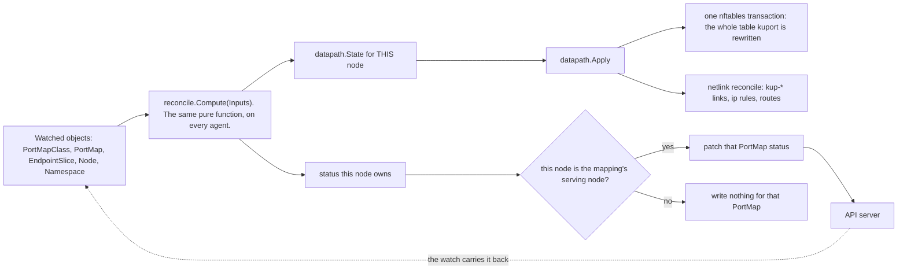
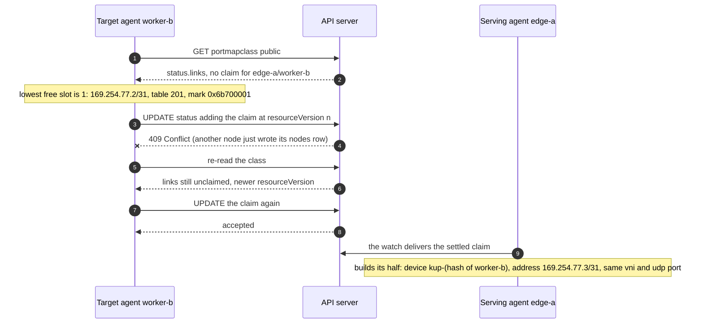
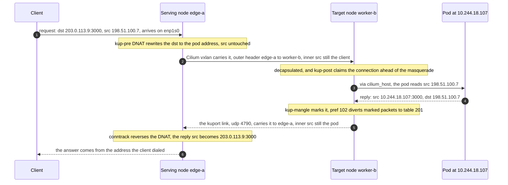
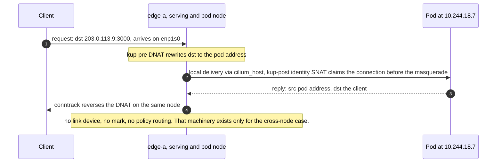
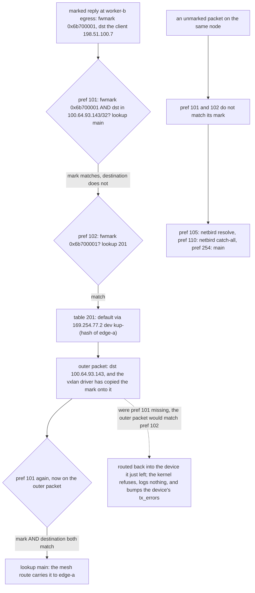

# kuport spec

Status: implemented, 2026-09-06, on branch `feat/initial-implementation`.
The code in this repo is what this spec describes: API types in
`internal/api/v1alpha1`, the pure reconcile in `internal/reconcile`, the host
layer in `internal/datapath`, and the agent binary in `cmd/kuport-agent`. The
unit, golden and envtest suites pass locally under the pinned toolchain, and
CI is wired to run them on every push. No cluster has been brought up against
this build, and none was available to build it against.

Every rule in the datapath section carried real traffic by hand on a live
cluster before this was written, and each one names the measurement that
confirmed it. That hand proof is about the rules themselves, not about the
built agent.

kuport delivers a TCP or UDP port from one node's addresses to a pod, keeping
the client's source address, and lets the workload ask for that itself.

## The problem

A Kubernetes cluster spread across sites has one node with a public address and
the rest behind home connections, joined by a WireGuard mesh. A game server, a
mail daemon, or anything else without an HTTP header to carry the truth needs
the client's real address. Nothing in Kubernetes does this.

| Mechanism | Why it does not apply |
| --- | --- |
| cloud load balancer | the provider owns the path; there is no provider |
| MetalLB, L2 or BGP | wants the entry point and the nodes on a routable network |
| Cilium DSR | the target replies directly with the service address as source, which home NAT rewrites |
| externalTrafficPolicy Local | requires the pod on the node the packet arrived at |
| hostPort | publishes only on the node the pod runs on |
| a reverse proxy or tunnel | re-originates the connection; the pod sees the proxy |

The gap is narrow and real: entry node and workload node in different NAT'd
sites, joined by a mesh whose tunnel enforces which source addresses each peer
may send.

## Goals

- A workload declares a port in its own namespace, beside its Service.
- The mapping follows the pod. A reschedule reprograms rather than drops.
- One mapping answers on several interfaces of the accepting node at once, so
  the same port is reachable on a LAN address and an overlay address.
- An internal port works the same as a public one; only the class differs.
- The pod sees the client's real address on every path.
- Two workloads asking for one port is reported rather than silently dropped.
- An admin decides which nodes, interfaces and ports exist, and who may ask.

## Non-goals

- HTTP routing or TLS. An ingress controller already does that better.
- Load balancing one port across pods on several nodes. One endpoint is chosen
  and reprogrammed when it goes away.
- IPv6 in the first version. Every rule here is `table ip`.
- Admission webhooks. Conflicts are reported in status; the reasoning is under
  Decisions.
- Replacing the CNI. kuport writes rules beside Cilium and depends on it.

## Requirements of the cluster

kuport is not portable to any cluster. It depends on these, and each dependency
is load-carrying rather than incidental.

| Requirement | Why |
| --- | --- |
| Cilium in tunnel mode (vxlan or geneve) | the encapsulation is what carries a client address past WireGuard's source check |
| pod addresses routable between nodes | the DNAT target is a pod address |
| the agent can write nftables and routes on the host | it runs as a DaemonSet with hostNetwork and NET_ADMIN |
| nodes reach each other on an address the mesh accepts | the return link's outer header uses those addresses |

Native routing instead of tunnelling breaks the inbound leg outright. That is
worth checking before deploying, and the agent reports it rather than failing
mysteriously.

## API

Group `kuport.wlz.li`, version `v1alpha1`. Two kinds.

### PortMapClass

Cluster-scoped. The admin writes it. It says which nodes accept traffic, on
which interfaces, which ports may be asked for, and which namespaces may ask.

```yaml
apiVersion: kuport.wlz.li/v1alpha1
kind: PortMapClass
metadata:
  name: public
spec:
  nodes:
    worker-1:
      interfaces:
        - wt0
        - enp1s0
    worker-2:
      interfaces:
        - wt0
        - eth0
  ports:
    min: 1024
    max: 65535
    reserved: [80, 443]
  namespaceSelector:
    matchLabels:
      kuport.wlz.li/public: allowed
  returnPath:
    mode: Vxlan
    vxlan:
      vni: 4242
      port: 4790
      subnet: 169.254.77.0/24
```

| Field | Type | Meaning |
| --- | --- | --- |
| nodes | map of node name to object | Nodes that may accept traffic for this class: its accepting nodes. Each mapping the class admits is programmed on exactly one of them, its serving node. A name with no Node object in the cluster is skipped. Required, at least one entry. |
| nodes.&lt;name&gt;.interfaces | list of string | Interface names that node's DNAT rules match on. One rule per interface, on the mapping's serving node. Naming them per node lets one class cover nodes whose NICs are named differently. Required, at least one. |
| ports.min, ports.max | int | The range a PortMap may ask for. Defaults 1, 65535. |
| ports.reserved | list of int | Ports the admin keeps back. A PortMap naming one is rejected in status. |
| namespaceSelector | label selector | Which namespaces may reference this class. Empty selects every namespace. |
| returnPath.mode | enum | `Vxlan` or `None`. `None` refuses any mapping whose pod is on another node. |
| returnPath.vxlan.vni | int | VXLAN network identifier for the links this class builds. |
| returnPath.vxlan.port | int | UDP port for the links. Must differ from the CNI's, which is 8472 for Cilium. Default 4790. |
| returnPath.vxlan.subnet | CIDR | Link addresses are allocated from here, a /31 per node pair (RFC 3021 point-to-point), so the default gives 128 slots. The slot for a pair is a recorded claim in status.links, not a computed hash. Default 169.254.77.0/24. |

### PortMap

Namespaced. The workload writes it, beside its Service.

```yaml
apiVersion: kuport.wlz.li/v1alpha1
kind: PortMap
metadata:
  name: gameserver
  namespace: games
spec:
  className: public
  protocol: UDP
  port: 3000
  serviceRef:
    name: gameserver
    port: game
```

| Field | Type | Meaning |
| --- | --- | --- |
| className | string | The PortMapClass this asks for. Required, immutable. |
| protocol | enum | TCP or UDP. Required, immutable. |
| port | int | The port clients dial on an accepting node, and the port the pod receives on. With endPort set, the first port of the range. Required, immutable. |
| endPort | int | Last port of an inclusive range starting at port. Omit for a single port. Immutable together with port; the API rejects endPort below port. One nftables `dport <first>-<last>` match covers a whole range. |
| interfaces | list of string | The interfaces this mapping binds on, narrowing what the class gives each node. Empty selects every interface the class gives the node. Mutable. |
| serviceRef.name | string | A Service in the same namespace. Required. |
| serviceRef.port | string | The named port on that Service. Required. |

The Service may be any type, ClusterIP included. It exists so the agent has
endpoints to follow and a named port to resolve. kuport never touches it.

### Choosing interfaces

A mapping's interfaces resolve against each accepting node's own list, so one
list covers nodes whose NICs are named differently. Given a class that gives
worker-1 wt0 and enp1s0, and worker-2 wt0 and eth0:

| The mapping asks for | worker-1 binds | worker-2 binds |
| --- | --- | --- |
| nothing | wt0, enp1s0 | wt0, eth0 |
| wt0, enp1s0, eth0 | wt0, enp1s0 | wt0, eth0 |
| wt0 | wt0 | wt0 |
| enp1s0 | enp1s0 | nothing |

Asking for wt0 alone keeps a mapping on the overlay. Asking for the LAN
interfaces as well as wt0 reaches clients on both. A name no node in the class
carries is rejected with reason InterfaceNotInClass, which is what catches a
typo; a name some node carries is accepted, since binding on a subset of the
nodes is the point of the field.

The immutable fields are immutable because changing them is indistinguishable
from deleting one mapping and creating another, and the reconcile is simpler if
it never has to unwind a half-changed mapping.

### PortMap status

```yaml
status:
  endpoint:
    node: worker-b
    address: 10.244.18.107
  published:
    - node: edge-a
      interface: enp1s0
      address: 203.0.113.9
    - node: edge-a
      interface: wt0
      address: 100.64.93.143
  observedGeneration: 3
  conditions:
    - type: Accepted
      status: "True"
      reason: Valid
    - type: Programmed
      status: "True"
      reason: AllNodesReady
```

`published` is what a person needs: the addresses this port answers on right
now, one row per class interface on the mapping's serving node. The DNAT rules
exist only there, so those are the only addresses where the port answers. It is
what `kubectl get portmap` prints in its wide columns.

The serving node writes the mapping's status, and every published row names one
of its own interfaces, so it resolves each address off its own host. A row whose
interface has not resolved yet carries an empty address and fills in on the next
pass.

| Condition | True when | Notable false reasons |
| --- | --- | --- |
| Accepted | the class exists, selects this namespace, the port range is inside the class range and unreserved, and no earlier mapping holds it | `ClassNotFound`, `NamespaceNotSelected`, `PortOutOfRange`, `PortReserved`, `PortConflict`, `InvalidPortRange` |
| Programmed | the serving node has written its rules and its class status row reports ready, and for a pod on another node the return link has landed with usable addresses at both ends | `NoReadyEndpoint`, `ReturnPathUnavailable`, `NodeNotReady` |

`InvalidPortRange` is the ceiling on the CEL rule that endPort must not be
below port: an update the API server let through still reports here.

`Programmed` gates on the participants: the serving node's row in the class
status, and for a remote pod the landed link slot. The other accepting nodes
hold nothing for the mapping, so their rows gate nothing. Until a gate clears,
the status names what is missing, and the level-driven reconcile heals it.

### Class status

The class reports each selected node's readiness verdict and which return links
hold an address slot.

```yaml
status:
  links:
    - key: edge-a/worker-b
      peers: [edge-a, worker-b]
      subnet: 169.254.77.2/31
      slot: 1
  nodes:
    - name: edge-a
      ready: true
      underlayMTU: 1400
      linkMTU: 1350
      addresses:
        enp1s0: 203.0.113.9
        wt0: 100.64.93.143
    - name: worker-c
      ready: false
      message: interface wt0 not present
  observedGeneration: 2
  conditions:
    - type: Ready
      status: "True"
      reason: Valid
```

One `links` entry per node pair that has, or recently had, a return link. The
`unusedSince` field appears when no PortMap needs the pair and is set to the
time that became true; an entry unused for 24h is dropped. The slot fixes the
routing table (`200 + slot`) and the packet mark (`0x6b700000 | slot`), so a
claim is never renumbered while a link uses it.

One `nodes` row per accepting node, written by that node's agent, carrying the
MTU numbers and interface addresses it read from the host. The row is ready when
every interface the class gives that node resolves to an address there;
otherwise it carries a message naming the first interface that does not. The
class names each node's interfaces, so an interface that fails to resolve is a
mistake in the class rather than a node that lacks the NIC, and the row says so
rather than skipping it. The Ready condition is per class:

| Condition | True when | Notable false reasons |
| --- | --- | --- |
| Ready | the subnet parses, has a free slot, the CNI is in tunnel mode, and the link port does not collide with it | `TunnelModeRequired`, `VxlanPortConflict`, `SubnetExhausted`, `InvalidSubnet` |

## Architecture

One DaemonSet. Each pod watches the API and programs the node it is on. There is
no central controller and no leader election.

```
PortMapClass ─┐
PortMap ──────┼─→ agent on each node ─→ desired ruleset for THIS node ─→ nftables
EndpointSlice ┘                      └─→ desired links and routes ────→ netlink
```

Every agent computes from the same inputs with the same deterministic
tie-breaks, so they agree without talking to each other. An endpoint moving
changes the input on every agent at once, through the same watch.



Every agent runs the computation; the picture is one node's pass. Two agents
reaching different conclusions would program different pods, which is why every
tie-break in Compute is deterministic rather than negotiated.

### The reconcile

The reconcile is level-driven. Each pass builds the complete desired state for
this node and applies it in one nftables transaction, so a mapping that was
deleted disappears by being absent rather than by anything remembering to
remove it.

Every agent resolves every PortMap from the same shared inputs, then emits only
the objects this node owns.

Resolution:

1. Resolve serviceRef to the ready IPv4 endpoints of the named port.
2. Choose one. Candidates on an accepting node rank above all others, ordered by
   accepting-node name and then by pod name within a node; with no candidate on
   an accepting node, the ready candidate with the smallest pod name wins. No
   input describes where the agent runs, so every agent picks the same
   endpoint.
3. Fix the serving node: the chosen endpoint's node when that node accepts the
   class, otherwise the first accepting node by name. Exactly one node serves
   each mapping.

Emission on the serving node:

1. A DNAT rule per interface in the class, rewriting the destination to the
   chosen pod's address and the same port or port range.
2. The masquerade exemption for the inbound leg.
3. When the chosen pod is on another node, this end of the return link, once its
   address slot has landed in the class status.

Emission on the node holding the chosen pod, when another node serves the
mapping:

1. This end of the return link.
2. The mark rule, the routing rules and the table entry.
3. The masquerade exemption for the reply.

Every other node emits nothing for the mapping.

### Status writing

The mapping's serving node writes its PortMap status; every other agent writes
none for that mapping. That gives exactly one writer per PortMap without leader
election, and it changes hands when the endpoint or the accepting set moves. A
refused or endpoint-less mapping has no serving node, so its status falls to the
chosen endpoint's node, else the first accepting node by name, else the first
node in the cluster: one writer in every case.

The class status has its own single-writer rule per field: each node writes its
own `nodes` row, and only the agent holding a mapping's endpoint proposes a
`links` claim. Two agents claiming the same pair collide on the API server's
optimistic concurrency, and the loser re-reads and adopts the winner's slot.

For a remote pod the serving node waits on the pod's node, because the claim
for their link pair is proposed there. Until it lands in the class status the
mapping reports `Programmed=False` with reason `ReturnPathUnavailable` and a
message naming the missing pair. The class status write is itself watched, so
the serving agent's next pass sees the settled claim and the condition clears.



The claim settles the whole derivation: the /31 ends are fixed by the sorted
node names, so both halves compute each other's address without exchanging
anything beyond the recorded slot.

## Datapath

Every rule below was built by hand on a live cluster on 2026-09-06 and carried
traffic. The measurements are recorded because several of them contradict what
the documentation suggests.

The two diagrams below are the routing in one glance: the cross-node case, and
the same-node case beside it so the machinery that is absent there is visible.

### The cross-node packet path



The reply does not retrace the request. The request entered through edge-a's
NIC and crossed to worker-b on Cilium's tunnel; the reply leaves worker-b
through kuport's own VXLAN device, a different tunnel on a different UDP port,
chosen only because the packet carries kuport's mark. Routing by default from
worker-b would send it out worker-b's own internet connection with the pod
address as source, and the client's firewall discards it as spoofed. The pod
address on the inside stays constant across both legs; that is what makes the
crossing possible.

### The same-node path



### Why the pod address

WireGuard accepts a decrypted packet only when its source falls inside the
allowed IPs of the peer that sent it, and a mesh gives each peer a single /32. A
forwarded packet keeping the client's source is discarded inside WireGuard,
before netfilter, so no nftables rule on either node can rescue it.

Measured: with a NodePort target, the accepting node translated and forwarded,
and every counter on the target node stayed at zero. The packet was gone before
prerouting.

Cilium's vxlan is what fixes it. A packet sent to a pod address is encapsulated,
the outer header carries the two nodes' addresses, WireGuard accepts it, and the
inner packet reaches the pod with the client's source intact. Measured: 54ms
round trip, cross-node, client address preserved.

Going to the pod address also removes two other problems. There is no second
port number from the 30000-32767 NodePort range for people to know about, and
there is no second DNAT. That matters, because a packet is destination-NATed
once per netfilter hook: an accepting node that DNATs to its own NodePort makes
kube-proxy's rules a no-op, so a mapping whose pod is on the accepting node
cannot work at all. Measured: the DNAT counter climbed, conntrack showed the
node address as the reply source rather than the pod's, and the pod never saw
the packet.

### The serving node

```
table ip kuport {
  chain kup-pre {
    type nat hook prerouting priority dstnat - 10; policy accept;
    iifname "<iface>" <proto> dport <port> counter dnat to <pod ip>:<port>
    ...one per interface per mapping...
  }

  chain kup-post {
    type nat hook postrouting priority srcnat - 10; policy accept;
    oifname "cilium_host" ip daddr <pod ip> <proto> dport <port> counter snat to ip saddr
  }

  chain kup-mangle {
    type filter hook prerouting priority mangle + 10; policy accept;
    ...empty on the serving node...
  }
}
```

A mapping with a port range renders one rule with a range match instead:
`udp dport 27015-27115 counter dnat to 10.244.18.107:27015-27115`. The
golden rulesets in `internal/datapath/testdata/` are the rendered truth.

The postrouting rule is an identity SNAT, and its job is to claim the connection
before Cilium does. Cilium rewrites the source of anything entering the pod
network through cilium_host whose source is outside the node's pod CIDR, which
is exactly a forwarded packet:

```
oifname "cilium_host" ip saddr != <node pod cidr> ip daddr != <node pod cidr> SNAT
```

Netfilter sets up source NAT once per hook, so the rule that claims the
connection first wins. Measured: with the exemption absent the pod reported the
node's cilium_host address as the client; with it present the pod reported the
real client.

The exemption carries the same `oifname` as the rule it precedes, so it claims
only what that rule would have claimed. Traffic reaching the same pod on the
same port from inside the cluster leaves by another interface and is untouched.

This depends on netfilter's once-per-hook behaviour and on kuport's chain
sorting first, rather than on the text of any Cilium rule, so a Cilium upgrade
that rewords its masquerade rules does not break it.

### Target node, when it is not the serving node

```
table ip kuport {
  chain kup-post {
    type nat hook postrouting priority srcnat - 10; policy accept;
    oifname != "cilium_*" ip saddr <pod ip> <proto> sport <port> counter snat to ip saddr
  }

  chain kup-mangle {
    type filter hook prerouting priority mangle + 10; policy accept;
    ip saddr <pod ip> <proto> sport <port> counter meta mark set <mark>
  }
}
```

```
ip rule  add pref 101 fwmark <mark> to <serving node address>/32 lookup main
ip rule  add pref 102 fwmark <mark> lookup <table>
ip route add default via <serving node link address> dev <link> table <table>
```

The postrouting rule exempts the reply from Cilium's egress masquerade, which
would otherwise rewrite its source to the node's own address and send it out
that node's own internet connection. Measured: without it, the reply left the
target site entirely and the client's conntrack discarded it.

The mark is what keeps the diversion narrow. Measured: a rule selecting on the
pod's address instead broke that pod's internet egress completely, while leaving
its in-cluster traffic alone, because Cilium's own routing rule at pref 9
catches that first.

### Two rule-ordering constraints

**The rule must sit above the mesh's.** netbird owns pref 110 and sends
everything without its mark to its own table, and pref 105 resolves the
destination out of the main table before that. A return rule at 32001 never
fires; the reply has already left. The rules go above 105 and below the local
table at 100.

**The first rule prevents a routing loop.** The VXLAN driver copies the packet's
mark onto the encapsulated packet, whose destination is the peer's address. That
outer packet then matches the second rule and is routed back into the device it
just came out of. The kernel refuses and increments the device's `tx_errors`
with no log line anywhere. Measured: one transmit error per probe, and the reply
never left.



### The return link

```
ip link add <name> type vxlan id <vni> local <own address> remote <peer address> \
  dstport <port> ttl 64
ip addr add <link address>/31 dev <name>
ip link set <name> up
```

The device name is `kup-` plus the first eight hex digits of sha256 of the
peer's node name, so both ends independently name the same device. The two
addresses of the /31 are fixed by the sorted pair: the alphabetically first
node takes the lower address.

```
ip addr add 169.254.77.2/31 dev kup-0d1fe83a4b2c  # edge-a, if that were its hash
```

The outer header carries the two nodes' addresses, which the mesh accepts, so no
key material is involved and nothing needs renewing. Measured: 12ms across two
sites on the first try.

The port must differ from the CNI's, 8472 for Cilium.

GRE would be lighter, 24 bytes against 50. Talos does not ship the module:
`ip link add type gre` answers `Unknown device type`. A second WireGuard link
would work and brings keys, which then need generating, storing and renewing.

### MTU

The link's overhead comes out of the same budget the CNI already spends. On the
cluster this was designed against, the mesh carries 1350, Cilium is configured
at 1350, and a pod can actually cross to another node at 1300. A reply is
therefore at most 1300 and the link's 50 bytes bring it to exactly 1350.

That is a tight fit with nothing spare, and it is worth checking rather than
assuming on any cluster. The agent reports the numbers it read from each node
in the class status, `underlayMTU` and `linkMTU` on the `status.nodes` rows,
so an operator can see the margin.

Note also that Cilium sets a pod's interface MTU to the underlay MTU rather than
50 below it, so a pod is always told 50 more than it can send between nodes. TCP
absorbs this through packetization-layer path MTU discovery in blackhole mode.
UDP does not, so a workload sending large datagrams needs its own send size kept
under the real figure. That is a property of the cluster rather than of kuport,
and it is documented here because a game server is exactly the workload that
hits it.

## Implementation notes

### Speak netlink and nftables directly

Use `github.com/google/nftables` and `github.com/vishvananda/netlink` rather
than shelling out to `nft` and `ip`. The image is then the binary on a scratch
base, with no package manager and nothing fetched at startup.

That last point matters. The predecessor this replaces ran an alpine image that
installed iproute2 and nftables from the Alpine mirror on every pod start, so a
node rebooting while the mirror was unreachable came up with no rules and the
forward stayed down until the install worked.

### nftables reserves words

`mark` and `fwd` cannot be used as chain names; the parser rejects them. Both
were found the hard way, one of them by a ruleset that had never run before.
Prefix kuport's chain names to stay clear of the grammar entirely.

### Idempotence and ownership

kuport owns exactly the objects it names:

| Object | Named |
| --- | --- |
| nftables table | `kuport`, family ip |
| nftables chains | `kup-pre`, `kup-post`, `kup-mangle` |
| vxlan links | `kup-` + first 8 hex of sha256(peer node name), 12 characters |
| routing tables | `200 + slot`, the slot recorded in the class status |
| routing rules | pref 101 loop guard, pref 102 divert, marks 0x6b700000 or'd with the slot |
| masquerade and mark rules | inside kuport's own chains, which are rewritten whole each pass |

Every pass rewrites the whole table in one transaction. Links, rules and routes
are reconciled by comparison, since they have no transaction. Anything the
agent finds under its own names and does not want is removed.

On shutdown the agent removes its table, links, rules and routes, so a node
taken out of a class stops holding state nobody wants. A crashed agent leaves
them, and the next start reconciles them away.

### What the agent must refuse

| Condition | Behaviour |
| --- | --- |
| the CNI is known not to tunnel (Vxlan classes) | report `Ready=False` with `TunnelModeRequired` on the class; the rules are still programmed, so a native-routing cluster shows green mappings whose cross-node traffic dies in the mesh. A mode that cannot be read (no cilium-config) is reported as unknown and refuses nothing |
| return link port collides with the CNI's | report `Ready=False` with `VxlanPortConflict` on the class |

A class that selects several nodes refuses nothing: each mapping has exactly
one serving node. Two accepting nodes forwarding to one remote pod would need
that pod's node to send each reply back to whichever node forwarded it, and
the reply carries nothing that says which. Making that work needs a distinct
port per accepting node and a return rule matching source port. The choice and
the serving node are computed once, from shared inputs, so every other
accepting node stays outside the mapping: no rules, no status, and no
refusal. When the first accepting node loses its candidate the mapping fails
over to the next one.

## Repo layout

```
cmd/kuport-agent/          the binary: flags, manager wiring, signals
internal/api/v1alpha1/     CRD types, deepcopy, validation
internal/reconcile/        the pure desired-state computation
internal/agent/            informers, host checks, status writes, teardown
internal/datapath/         nftables and netlink, the only package that touches the host
internal/datapath/testdata golden rulesets
config/crd/                generated CRD manifests
config/samples/            a PortMapClass and a PortMap
deploy/                    DaemonSet, ServiceAccount, ClusterRole, published per release
chart/                     the Helm chart, same contents parameterized
docs/spec.md               this file
docs/operations.md         reading status, the counters, what each failure looks like
docs/integration.md        installing kuport into a cluster, for the next agent
.github/workflows/         ci.yaml, release.yaml
```

`internal/datapath` is the only package allowed to touch the host. Everything
above it takes a desired-state struct and returns one, which is what makes the
reconcile testable without a cluster or root.

## Build and release

GitHub Actions.

**ci.yaml**, on push and pull request. The check job runs `go vet`,
`go test ./... -race`, `golangci-lint run`, and `go build ./...` under
`nix develop -c`, so CI and a developer shell use the same toolchain. A second
job runs `make verify`, which regenerates the CRDs and fails on any diff
against committed `config/crd/`, so generated files cannot drift. A third job
runs the envtest tier against a real API server, with the kubebuilder assets
pinned to 1.37.0. A fourth builds the image for linux/amd64 without pushing,
and a fifth lints and renders the Helm chart and dry-run applies the render
against the API schemas.

**release.yaml**, on a tag matching `v*` (plain semver; suffixes are rejected):
build and push the image to `ghcr.io/walzen-group/kuport-agent`, tagged with the
version and the rolling minor, with the digest reported in the job summary.
Then three artifacts are attached to the GitHub Release:
`kuport-<version>.yaml`, the rendered `deploy/` tree with the image pinned to
that digest; `kuport-<version>.tgz`, the packaged chart; and
`crds-<version>.yaml`, the CRD bundle, because the schemas move on their own
schedule. The packaged chart is also pushed to `oci://ghcr.io/walzen-group/kuport`
as an OCI artifact at the release version, with the image digest baked into its
values, so a GitOps consumer can pull the chart by reference. The chart's own
image default is the tag `v<appVersion>`, which is the form a release pushes;
installing the chart from a source checkout needs a published release or an
explicit tag or digest.

Consumers pin by tag and digest together. The digest is what decides; the tag is
for people.

Versioning is semver on the agent. The CRD version moves separately and only for
a schema change, which is what `v1alpha1` in the group means.

## Testing

**Unit.** The desired-state computation, given a set of PortMapClasses,
PortMaps, EndpointSlices, Nodes, Namespaces and a node name. Table-driven, no
cluster, no root. This is where endpoint choice, conflict ordering, class
selection, link slot allocation and every refusal are covered.

**Golden rulesets.** The datapath package renders a desired state to the exact
nftables ruleset and netlink objects it would apply, compared against files in
testdata. A change to a rule is then visible in a diff during review, which
matters for rules whose failure mode is a silent drop.

**envtest.** The controller against a real API server with no nodes, covering
status writing, conditions and the watch plumbing. The CEL immutability rules
were proved server-side this way.

**End to end.** A kind cluster cannot exercise this: the whole design is about
what happens between two machines joined by a mesh. The end-to-end test is
specified as a script that runs against a real cluster, brings up an echo
responder, applies a PortMap, probes it from outside, and asserts the reply
names the prober's own address. It would run by hand, not in CI. As of this
writing no such script is in this repo, and no tier of testing has involved a
cluster: the build, its tests and its docs all happened without one.

What has actually run: the unit, golden and envtest suites, locally under the
flake's pinned toolchain and on every push in GitHub Actions. The hand
measurements quoted in Datapath above
predate the code and belong to the rules, not to this implementation.

## Deployment

The cluster's own infrastructure repo consumes a release: the CRDs and the
DaemonSet as manifests, the image pinned by digest, and the PortMapClass objects
written from that cluster's inputs. kuport ships the manifests and the image and
knows nothing about any particular cluster.

## Decisions

These were the spec's open questions. Each is closed; the implementation
records the answer, and none of them is re-opened here.

### Port ranges

`spec.port` is required; `spec.endPort` is optional and inclusive, mirroring
NetworkPolicy's port and endPort. A ranged mapping renders one nftables match,
`dport <first>-<last>`, not a rule per port.

The shape was chosen because a single port needs no new field, a range needs no
hundred objects, and the field pair is one people already know from
NetworkPolicy.

### No ready endpoint

The DNAT rule is removed. The port then refuses, with a TCP reset or an ICMP
port-unreachable, rather than blackholing, and the mapping reports
`Programmed=False` with reason `NoReadyEndpoint`.

A client learns immediately instead of hanging until its own timeout. The cost
is accepted on both sides: connections do not survive a rollout, and the old
rule is never left in place to keep them alive.

### Link address allocation

A recorded claim in `PortMapClass.status.links`, not a computed hash. A /31 per
node pair out of the class subnet, 128 slots in the default /24. The
endpoint-holding agent allocates the lowest free slot and writes the claim; the
accepting agent reads it. The API server's optimistic concurrency is the
arbiter: a 409 means re-read, redo, retry.

The API server is already a consistent store with compare-and-swap, so this
needs no leader, no election, and no agent-to-agent protocol. Collisions become
impossible rather than handled, the allocation is visible in
`kubectl get portmapclass -o yaml`, and the scheme reuses the single-writer
rule the design already had for status. A computed hash was rejected because
two agents computing the same slot from stale views cannot detect each other,
which is a collision-repair protocol in disguise.

### Link release

A claim is freed after 24h unused, and any agent the class selects may run the
garbage collection. The link device is not held by that window: it is torn down
immediately by being absent from the next desired state. The status entry
lingers only to hold the address reservation.

Nothing carries traffic through a free window, so the GC needs no locking, and
clock skew between nodes is irrelevant against 24h. A per-pair teardown protocol
was rejected for the same reason the allocation uses the API server: the device
lifecycle is already level-driven, and the reservation is the only thing that
needs a timer.

### Host firewall

kuport writes `nat` and `mangle` in its own table and never anything in
`filter`. It also does not detect foreign filter rules. `docs/operations.md`
tells the operator plainly: a node with a host firewall needs the port opened
there by whatever manages that firewall, and kuport will report the mapping
healthy while the port stays shut.

Writing the accept rule and detecting a foreign one have the same portability
problem across nftables, iptables-legacy, firewalld and ufw, and a wrong "looks
fine" from a half-detection is worse than no check. The positive reason kuport
stays out of `filter` entirely: a workload-authored PortMap must not be able to
punch a hole in the host firewall.

### Integration testing

GitHub Actions runs the unit, golden and envtest tiers. The e2e tier is
specified above as a hand-run script; it does not exist yet, and no cluster
was wired to this repo during the build. So the release is untested against a
cluster until someone runs that tier. README and the guides say so rather
than leaving it to be discovered.

## Still open

- **Other CNIs.** The design needs encapsulation, which Calico with VXLAN or
  Flannel also provide. Nothing here is Cilium-specific except the two
  masquerade exemptions, which are matched by interface and would need their
  equivalents identified per CNI.
